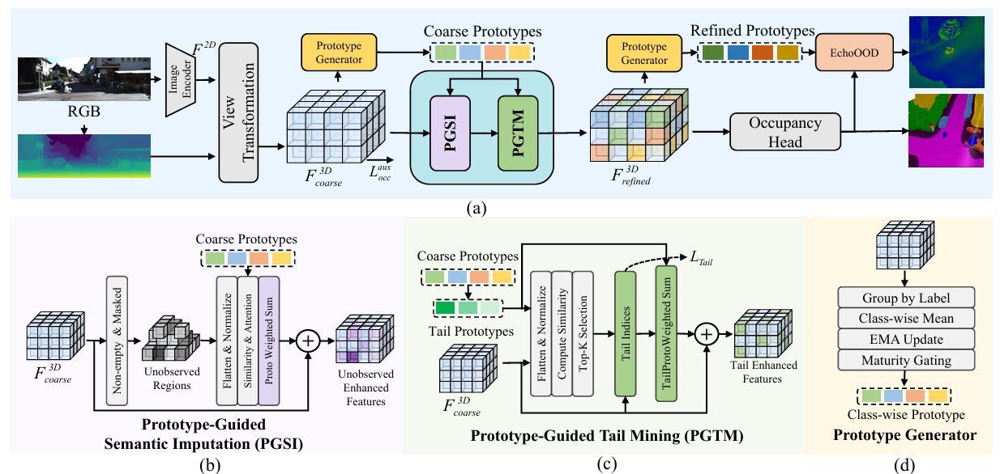

# ProOOD: Prototype-Guided Out-of-Distribution 3D Occupancy Prediction

[](https://arxiv.org/abs/2604.01081)
[](https://github.com/7uHeng/ProOOD)
[](https://opensource.org/licenses/Apache-2.0)

<p align="center">
  
</p>

We present **ProOOD**, a lightweight plug-and-play method that addresses **long-tailed class bias** and **out-of-distribution (OOD)** detection in 3D semantic occupancy prediction, via three core designs: (1) **Prototype-Guided Semantic Imputation** to fill occluded regions, (2) **Prototype-Guided Tail Mining** to strengthen rare-class representations, and (3) **EchoOOD Score**, a training-free OOD detector fusing local logit coherence with prototype matching.

---

| [🛠️ Installation](#installation) | [📂 Data](#data-preparation) | [🏋️ Training](#training--evaluation) | [📦 Weights](#pretrained-weights) | [🌿 Branches](#branches) | [📜 Citation](#citation) |
|:---:|:---:|:---:|:---:|:---:|:---:|

---

## 🛠️ Installation

Setup details in **[docs/install.md](docs/install.md)** — Conda, PyTorch 1.9.1 + CUDA 11.1, mmdet3d, spconv, etc.

## 📂 Data Preparation

Details in **[docs/dataset.md](docs/dataset.md)** for SemanticKITTI, KITTI-360, Vaakitti, Vaakitti360, and STU.

## 🏋️ Training & Evaluation

All commands in **[docs/run.md](docs/run.md)**. Quick start:

```bash
# train (4 GPUs)
./tools/dist_train.sh projects/configs/sgn/proood-semkitti.py 4

# eval
./tools/dist_test.sh projects/configs/sgn/proood-semkitti.py ./path/to/ckpts.pth 4

# OOD
./tools/dist_test_ood.sh projects/configs/sgn/proood-ood-vaakitti.py ./path/to/ckpts.pth 4
```

## 📦 Pretrained Weights

| Config | Train Set | Train Depth | Test Depth | OOD | Weights |
|:--|:--|:--|:--|:--:|:--|
| `proood-semkitti` | SemanticKITTI | MSN | MSN | — | [link](https://github.com/7uHeng/ProOOD/releases/download/v1.0/proood_sgn_semkitti_occ.pth) |
| `proood-sql-semkitti` | SemanticKITTI | SQL | SQL | ✓ | [link](https://github.com/7uHeng/ProOOD/releases/download/v1.0/proood_sgn_sql_ood.pth) |
| `proood-kitti360` | KITTI-360 | MSN | MSN | — | [link](https://github.com/7uHeng/ProOOD/releases/download/v1.0/proood_sgn_kitti360_occ.pth) |
| `proood-sql-kitti360` | KITTI-360 | SQL | SQL | ✓ | [link](https://github.com/7uHeng/ProOOD/releases/download/v1.0/proood_sgn_sql_kitti360_ood.pth) |
> **MSN** = MobileStereoNet. All models use the SGN backbone.  

## 🌿 Branches

ProOOD is backbone-agnostic. Two reference implementations are provided:

| Branch | Backbone | Status |
|:--|:--|:--:|
| [`main`](https://github.com/7uHeng/ProOOD/tree/main) | **SGN** | ✅ |
| [`baseline_b`](https://github.com/7uHeng/ProOOD/tree/baseline_b) | **VoxDet** | 🚧 |

```bash
git checkout main          # SGN
git checkout baseline_b    # VoxDet
```

## 📜 Citation

```bibtex
@article{zhang2026proood,
  title   = {ProOOD: Prototype-Guided Out-of-Distribution 3D Occupancy Prediction},
  author  = {Zhang, Yuheng and Duan, Mengfei and Peng, Kunyu and Wang, Yuhang and
             Wen, Di and Paudel, Danda Pani and Van Gool, Luc and Yang, Kailun},
  journal = {arXiv preprint arXiv:2604.01081},
  year    = {2026}
}
```

## 🙏 Acknowledgement

Thanks to the authors of [SGN](https://github.com/Jieqianyu/SGN), [ProtoOcc](https://github.com/SPA-junghokim/ProtoOcc), [VoxDet](https://github.com/vita-epfl/VoxDet), and [mmdet3d](https://github.com/open-mmlab/mmdetection3d).
